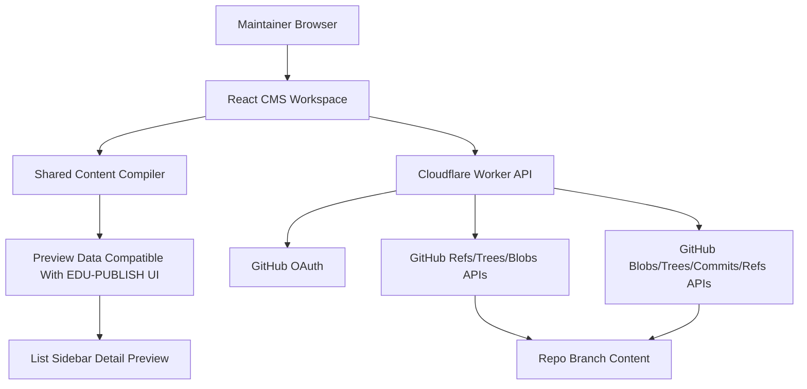

# Design Document

## Overview

EDU-PUBLISH-CMS 提供一个 GitHub 驱动的内容编辑工作台，用来编辑 EDU-PUBLISH 兼容仓库中的单层 `content/card/**/*.md` 卡片文件，并将修改后的内容直接提交到用户选择的 GitHub 分支。

本设计刻意保持与参考项目 `ref/EDU-PUBLISH` 的展示逻辑一致，但不直接依赖参考目录中的运行时代码。参考目录仅用于复用组件结构、交互模式、数据模型和编译规则。CMS 的核心新增能力包括：GitHub OAuth 会话、仓库与分支工作区、浏览器内预览编译、Worker 端校验与原子化 Git 提交。

本期设计不引入 `origin/card` 双层内容模型，也不支持编辑 `config/**` 或应用代码。配置文件只作为只读预览依赖加载。

## Steering Document Alignment

### Technical Standards (tech.md)

当前仓库尚未提供 `tech.md`。本设计以 `plan.md` 和 `ref/EDU-PUBLISH` 为事实来源，并采用以下技术约束：

- 前端：React 19 + Vite + TypeScript。
- UI：继续沿用参考项目中的 Tailwind、Radix UI、Framer Motion、Lucide React 体系。
- 后端：Cloudflare Worker，负责 OAuth 回调、会话、GitHub API 代理、校验与发布。
- 仓库交互：使用 GitHub OAuth Web Flow，并通过 GitHub REST API 读取仓库、创建提交、更新分支引用。
- 安全基线：OAuth 使用 PKCE 与 `state`；浏览器不直接持有 GitHub token。

### Project Structure (structure.md)

当前仓库尚未提供 `structure.md`。为兼容 EDU-PUBLISH 的前端复用方式，同时把 Worker 逻辑从前端中分离，本项目建议采用如下结构：

```text
components/
  cms/
  preview/
hooks/
lib/
  content/
  config/
  github/
  serialization/
types/
worker/
  routes/
  auth/
  github/
  session/
App.tsx
index.tsx
```

结构约束如下：

- `components/preview/` 放接近 EDU-PUBLISH 的列表页、详情弹层和侧栏预览组件。
- `components/cms/` 放仓库选择、字段编辑、发布面板等 CMS 专属 UI。
- `lib/content/` 放单层 card 解析、校验、预览编译等纯逻辑，要求浏览器与 Worker 共享。
- `worker/` 放所有 GitHub OAuth、会话和发布 API 逻辑，不与 React 组件耦合。

## Code Reuse Analysis

当前参考项目中有多块代码可以直接复用或低成本迁移：

### Existing Components to Leverage

- **`ref/EDU-PUBLISH/App.tsx`**: 提供整体壳层、列表与详情联动、当前预览页面的布局基线。
- **`ref/EDU-PUBLISH/components/LeftSidebar.tsx`**: 已实现按学院与订阅分类组织列表的侧栏结构，可作为预览侧栏基础。
- **`ref/EDU-PUBLISH/components/ArticleList.tsx`**: 已实现卡片列表、筛选、分页、桌面/移动端切换，可作为内容预览主列表基础。
- **`ref/EDU-PUBLISH/components/NoticeDetailModal.tsx`**: 已具备同页详情弹层、ESC/遮罩关闭、上下条切换、滚动锁定，以及“附件优先于正文”的展示结构。
- **`ref/EDU-PUBLISH/hooks/use-feed-data.ts`**: 已具备把编译结果映射为学院和订阅树的逻辑，适合预览态数据分组。
- **`ref/EDU-PUBLISH/types.ts`**: `Article`、`Feed`、`CompiledContent`、`NoticeAttachment`、`NoticeSource` 等类型可以作为 CMS 预览数据模型的起点。

### Existing Logic to Extract or Rebuild Carefully

- **`ref/EDU-PUBLISH/scripts/compile-content.mjs`**: 这是当前单层 card 规则的事实来源，包含 frontmatter 读取、附件归一化、正文中的内联附件提取、排序规则、搜索索引字段、`source.channel` 到订阅配置的映射等逻辑。
- **`ref/EDU-PUBLISH/scripts/compile-site-config.mjs`**: 提供 `config/site.yaml` 到预览站点品牌配置的归一化规则。
- **`ref/EDU-PUBLISH/scripts/compile-widgets-config.mjs`**: 提供 `config/widgets.yaml` 默认值合并规则。

这些脚本当前依赖 Node `fs` 和本地目录扫描，不能原样运行在浏览器或 Worker 中。设计上应将其中“纯解析与归一化逻辑”抽离为共享模块，由浏览器预览和 Worker 校验共同调用。

### Integration Points

- **GitHub OAuth**: 使用 GitHub OAuth Web Flow，Worker 负责重定向、回调换 token、用户校验和会话下发。
- **GitHub Repository Read APIs**: 使用 refs、trees、blobs 或 contents 读取选定分支下的 card 文件与只读配置文件。
- **GitHub Git Database Write APIs**: 使用 blobs、trees、commits、refs 生成单次原子提交，避免多文件更新时的串行 contents API 冲突。

## Architecture

系统采用“浏览器编辑 + Worker 校验推送”的双层架构。



### High-Level Flow

1. 浏览器访问 CMS，未登录时由 Worker 发起 GitHub OAuth。
2. Worker 完成回调后创建安全会话，浏览器通过 `/api/session` 获取当前身份。
3. 浏览器选择仓库与分支，Worker 读取对应分支下的 `content/card/**/*.md` 与只读配置文件，返回工作区。
4. 浏览器在本地维护草稿状态，并通过共享编译器把草稿转成接近 `CompiledContent` 的预览结构。
5. 预览 UI 复用 EDU-PUBLISH 的列表页、详情弹层和附件展示模式。
6. 用户点击发布时，Worker 使用同一套共享校验规则做最终校验，再调用 GitHub Git Database APIs 创建单次提交并更新目标分支。

### Modular Design Principles

- **Single File Responsibility**: 前端页面容器、字段编辑器、预览组件、GitHub 网关、解析器、序列化器分别负责单一职责。
- **Component Isolation**: EDU-PUBLISH 风格预览组件不直接依赖 GitHub API，CMS 表单组件不直接依赖详情弹层内部实现。
- **Service Layer Separation**: Worker 中的 OAuth、会话、仓库读取、发布提交分为独立服务。
- **Utility Modularity**: frontmatter 解析、附件归一化、配置归一化、差异计算、分支并发校验均应保持纯函数化。

## Components and Interfaces

### Component 1: `CmsWorkspaceShell`

- **Purpose:** 作为浏览器端主壳层，协调登录状态、仓库与分支选择、编辑器、预览区和发布流程。
- **Interfaces:** 无外部 props；内部消费会话 API、仓库加载 API、发布 API。
- **Dependencies:** `RepoSelector`, `CardEditorPanel`, `PreviewPane`, `PublishDialog`, `DraftWorkspaceStore`。
- **Reuses:** 参考 `ref/EDU-PUBLISH/App.tsx` 的页面组织方式和列表/详情联动模式。

### Component 2: `DraftWorkspaceStore`

- **Purpose:** 管理当前仓库工作区的本地草稿，包括分支基线、文件快照、dirty 状态、选中卡片、验证结果和发布草稿。
- **Interfaces:** `loadWorkspace()`, `selectCard(id)`, `updateField(path, value)`, `updateBody(markdown)`, `applyAttachmentChange()`, `discardDraft()`, `buildPublishPayload()`。
- **Dependencies:** `CardDocumentSerializer`, `PreviewCompiler`, `WorkspaceDiffBuilder`。
- **Reuses:** 复用参考项目偏向 React hooks 的状态模式，而不是新增全局状态库。

### Component 3: `CardEditorPanel`

- **Purpose:** 提供 card 文件的结构化字段编辑能力，覆盖单层 schema 中的常用 frontmatter 字段和正文 Markdown。
- **Interfaces:** `card: CardDocument`, `issues: ValidationIssue[]`, `onChange`, `onAttachmentUpload`, `onAttachmentRemove`。
- **Dependencies:** `DraftWorkspaceStore`, `FieldValidationHelpers`。
- **Reuses:** 复用 EDU-PUBLISH 现有表单视觉语言、按钮、输入框、滚动容器和配色体系。

### Component 4: `PreviewPane`

- **Purpose:** 把当前草稿编译结果渲染成 EDU-PUBLISH 风格预览，包括侧栏、列表、详情弹层和附件下载区。
- **Interfaces:** `compiledPreview: CmsPreviewModel`, `selectedCardId`, `onCardSelect`, `onDetailClose`。
- **Dependencies:** `LeftSidebar`, `ArticleList`, `NoticeDetailModal`, `useFeedData`, `useArticleNavigation`。
- **Reuses:** 直接复用或轻改 `ref/EDU-PUBLISH/components/LeftSidebar.tsx`、`ArticleList.tsx`、`NoticeDetailModal.tsx`。

### Component 5: `PreviewCompiler`

- **Purpose:** 在浏览器中把只读配置和 card 草稿编译为预览用数据模型，同时返回结构化校验错误。
- **Interfaces:** `compileWorkspace(workspace): { preview: CmsPreviewModel | null; issues: ValidationIssue[] }`。
- **Dependencies:** `SiteConfigNormalizer`, `WidgetsConfigNormalizer`, `SubscriptionsNormalizer`, `CardDocumentParser`, `AttachmentNormalizer`。
- **Reuses:** 对齐 `compile-content.mjs` 的排序、附件提取、来源映射与搜索字段规则。

### Component 6: `WorkerAuthService`

- **Purpose:** 处理 GitHub OAuth 起跳、回调换 token、用户信息校验和退出登录。
- **Interfaces:**
  - `GET /api/auth/github/start`
  - `GET /api/auth/github/callback`
  - `POST /api/auth/logout`
  - `GET /api/session`
- **Dependencies:** `OAuthStateStore`, `SessionCookieCodec`, GitHub OAuth endpoints。
- **Reuses:** 无直接代码复用，但需遵守 GitHub OAuth Web Flow + PKCE。

### Component 7: `WorkerRepositoryService`

- **Purpose:** 读取仓库列表、分支信息、工作区文件，并在发布时完成最终校验与原子提交。
- **Interfaces:**
  - `GET /api/repos`
  - `GET /api/repos/:owner/:repo/branches`
  - `POST /api/workspace/load`
  - `POST /api/workspace/validate`
  - `POST /api/publish`
- **Dependencies:** `GitHubApiClient`, `RepoCompatibilityChecker`, `PreviewCompiler`, `GitCommitBuilder`。
- **Reuses:** 重用参考编译规则，但不复用 Node `fs` 访问方式。

## Data Models

### Model 1

```ts
type CardFrontmatter = {
  id: string
  school_slug: string
  title: string
  description: string
  published: string
  category: string
  tags: string[]
  pinned: boolean
  cover?: string
  badge?: string
  extra_url?: string
  start_at?: string
  end_at?: string
  source?: {
    channel?: string
    sender?: string
  }
  attachments?: Array<{
    name: string
    url: string
    type?: string
  }>
  [key: string]: unknown
}

type CardDocument = {
  id: string
  path: string
  sha: string
  raw: string
  frontmatterText: string
  bodyMarkdown: string
  keyOrder: string[]
  data: CardFrontmatter
  dirty: boolean
}
```

该模型以“保留原文 + 结构化可编辑字段”双表示存在，目的是同时满足 GUI 编辑和 round-trip fidelity。`keyOrder` 用于减少 frontmatter 重写时的无关字段抖动。

### Model 2

```ts
type DraftWorkspace = {
  repo: { owner: string; name: string }
  branch: string
  baseHeadSha: string
  cards: CardDocument[]
  readonlyConfig: {
    siteYaml: string
    widgetsYaml: string
    subscriptionsYaml: string
  }
  attachments: Array<{
    path: string
    sha: string
    size: number
  }>
}

type ValidationIssue = {
  severity: 'error' | 'warning'
  filePath: string
  fieldPath?: string
  message: string
}

type PublishRequest = {
  repo: { owner: string; name: string }
  baseBranch: string
  targetBranch: string
  baseHeadSha: string
  commitMessage: string
  changes: Array<{
    path: string
    operation: 'upsert' | 'delete'
    encoding: 'utf-8' | 'base64'
    content?: string
  }>
}
```

`PublishRequest` 明确限制可写文件集合，便于 Worker 做路径 allowlist 校验并构建单次提交。

## GitHub Interaction Design

### Session Strategy

- 浏览器不直接保存 GitHub access token。
- Worker 在 OAuth 回调完成后，用加密的 HttpOnly、Secure、SameSite=Lax 会话 cookie 保存最小必要会话信息。
- 每次 API 请求由 Worker 解密会话并代替浏览器访问 GitHub API。

这样可以避免把 GitHub token 暴露到浏览器脚本，同时保持部署简单，不强制引入额外数据库作为会话存储。

### Workspace Load Path

`POST /api/workspace/load` 的内部流程如下：

1. 校验当前会话与仓库访问权限。
2. 读取目标分支 ref，记录 `baseHeadSha`。
3. 通过 Git tree API 递归读取分支树，筛选 `content/card/**/*.md`、`content/attachments/**`、`config/site.yaml`、`config/widgets.yaml`、`config/subscriptions.yaml`。
4. 对 Markdown 和 YAML 文件读取 blob 内容，返回给浏览器。
5. Worker 先做一次轻量兼容性检查，确保必需文件存在后再创建工作区。

### Publish Path

`POST /api/publish` 的内部流程如下：

1. 重新读取目标分支 head SHA。
2. 若当前 head 与 `baseHeadSha` 不一致，则立即返回冲突错误，不做任何写入。
3. 使用共享编译器对变更后的 card 文件做最终校验。
4. 若目标分支不存在且用户选择“新建分支”，则从 `baseBranch` 创建 `targetBranch` ref。
5. 为所有变更文件创建 blobs。
6. 基于当前分支 tree 创建新 tree。
7. 基于当前分支 commit 创建新 commit。
8. 以 `force: false` 更新目标 ref 到新 commit，实现单次原子发布。

选择 Git Database APIs 而不是多次 `PUT /contents/{path}` 的原因是：

- 一次发布可能同时修改多个 Markdown 文件和附件。
- GitHub Contents API 对并发写入存在冲突限制。
- 原子单提交更符合“上传并选择分支”的产品预期，也更容易返回一次性 commit 结果。

## Preview Compilation Design

浏览器内预览编译器是本项目最关键的共享逻辑之一。它必须复现当前 EDU-PUBLISH 的单层内容规则，而不是发明新 schema。

### Compilation Steps

1. 解析 `site.yaml`，补齐色板和 `_computed` 预览字段。
2. 解析 `widgets.yaml`，合并默认值。
3. 解析 `subscriptions.yaml`，生成学校、分类、订阅映射。
4. 解析所有 `content/card/**/*.md` 文件，提取 frontmatter 和 Markdown 正文。
5. 对 `attachments` 执行与参考仓库一致的归一化。
6. 从正文 Markdown 中提取内联附件与链接，并与 frontmatter 附件合并去重。
7. 基于 `source.channel` 与订阅配置映射生成预览用 feed 数据。
8. 输出可直接驱动 `LeftSidebar`、`ArticleList`、`NoticeDetailModal` 的预览模型。

### Fidelity Rules

- 排序规则对齐参考仓库：学校顺序、订阅顺序、`pinned`、发布时间、`guid` 兜底。
- 详情弹层保留当前 EDU-PUBLISH 的同页弹层方案，不改 URL，不新增详情路由。
- 附件区保持标题后、正文前的固定顺序。
- 预览阶段以当前草稿为准，不依赖远端 `public/generated/*.json`。

## Development Workflow

本项目的开发文档必须把“避免盲开发”作为硬约束，而不是建议项。实现阶段必须依赖真实 CLI 反馈循环，不能只靠静态阅读代码或一次性生成大量代码后再祈祷它能跑。

### Required Local Scripts

实现时必须提供并长期维护以下脚本契约：

```json
{
  "scripts": {
    "dev": "run web and worker together",
    "dev:web": "vite",
    "dev:worker": "wrangler dev",
    "typecheck": "tsc --noEmit",
    "typecheck:watch": "tsc --noEmit --watch",
    "test": "run all vitest projects",
    "test:unit": "vitest run --project unit",
    "test:unit:watch": "vitest --project unit",
    "test:integration": "vitest run --project integration",
    "test:integration:watch": "vitest --project integration",
    "test:e2e": "playwright test",
    "test:e2e:ui": "playwright test --ui",
    "build": "production build",
    "lint": "eslint ."
  }
}
```

脚本命名可以微调，但能力不能缺。至少要满足：

- 前端 dev server 可运行。
- Worker 本地服务可运行。
- TypeScript 错误可持续监控。
- 单元/集成测试可聚焦到当前改动并进入 watch 模式。
- E2E 可对关键链路做真实回归。

### Mandatory Feedback Loops

任何非平凡任务开始前，开发者必须先选定最小且真实的反馈回路，并在实现期间持续运行。推荐基线：

1. 一个长期运行的本地服务：`pnpm run dev` 或分开运行 `pnpm run dev:web` 与 `pnpm run dev:worker`。
2. 一个持续类型反馈：`pnpm run typecheck:watch`。
3. 一个面向当前任务的 focused watch：`pnpm run test:unit:watch` 或 `pnpm run test:integration:watch`。

没有活跃 CLI 反馈回路时，不应继续做大段代码生成。对 AI 辅助开发同样适用。

### Task-to-Feedback Mapping

不同类型改动应绑定不同的最小反馈回路：

| 改动类型 | 首选反馈命令 | 辅助命令 |
|---|---|---|
| Markdown 解析、frontmatter 序列化、附件归一化 | `pnpm run test:unit:watch` | `pnpm run typecheck:watch` |
| Worker 路由、GitHub API 集成、发布逻辑 | `pnpm run test:integration:watch` | `pnpm run dev:worker` |
| React 表单、预览列表、详情弹层交互 | `pnpm run test:unit:watch` | `pnpm run dev:web` |
| 端到端流程、发布前回归 | `pnpm run test:e2e:ui` 或 `pnpm run test:e2e` | `pnpm run dev` |

## TDD Workflow

### TDD Is the Default for Non-Trivial Changes

本项目默认采用测试先行的增量开发，尤其适用于共享编译器、序列化器、Worker 发布逻辑和关键交互组件。原因很直接：这些模块最容易在“看起来合理”的情况下 quietly break。

### Required TDD Loop

每个非平凡任务都应遵循以下顺序：

1. 先选最小测试层级。
2. 先写失败用例，证明当前行为不满足需求。
3. 跑 focused watch，亲眼看到失败。
4. 只写让当前测试转绿的最小代码。
5. 在保持 green 的前提下整理实现。
6. 扩大验证范围，补跑更广的测试与 build。

### Choosing the Smallest Useful Test Layer

- **Pure logic first**: card 解析、YAML 归一化、diff 计算、路径校验优先写单元测试。
- **Contract before route body**: Worker API 先写请求/响应契约与失败场景测试，再写 handler。
- **Interaction before polish**: React 编辑器和预览交互先验证数据流、键盘操作、弹层开关，再做样式细节。
- **E2E last, but mandatory for cross-layer flows**: 登录、加载工作区、编辑、预览、发布至少要有关键 happy path 和 1 个冲突失败流。

### Bugfix Rule

任何 bug 修复都必须先满足以下二选一：

1. 增加一个先失败后转绿的自动化测试。
2. 若暂时无法自动化，则必须先写清晰的 CLI 复现路径，并在修复后把它补回自动化测试。

禁止“凭感觉改一把再看看”的修 bug 方式。

## Debugging Strategy

### Debugging Principles

- 先复现，再定位，再修复，再回归。
- 优先缩小问题范围，而不是扩大日志噪音。
- 调试输出必须带上下文，但绝不打印 token、cookie、secret。
- 所有难以人工稳定复现的问题，最终都应沉淀为 fixture、测试或最小复现脚本。

### Required Debug Surfaces

实现中应主动提供这些调试面：

1. **CLI test output**: 失败测试直接定位到断言、文件、输入 fixture。
2. **Worker request logs**: 至少包含 `requestId`、repo、branch、base SHA、changed path count、GitHub status code、耗时。
3. **Preview compile logs**: 至少包含出错文件、字段路径、错误原因。
4. **Dev-only UI diagnostics**: 在开发模式下提供轻量调试信息，例如当前选中卡片 id、dirty 文件数、最后一次编译耗时、当前 base head SHA。

### Debug Recipes

#### 1. Parser or Serialization Bugs

- 先用最小 Markdown fixture 复现。
- 跑 `pnpm run test:unit:watch`。
- 比对输入 raw text、解析结构、重新序列化结果。
- 先锁定 round-trip 不一致点，再改实现。

#### 2. Preview Mismatch Bugs

- 同时打开 `pnpm run dev:web` 和 focused unit watch。
- 在 dev-only diagnostics 中观察当前预览使用的 card 数、错误数、编译耗时。
- 若预览与期望不一致，优先检查共享编译器输出，而不是先怀疑 UI。

#### 3. Publish or GitHub Conflict Bugs

- 运行 `pnpm run dev:worker`。
- 查看请求日志中的 `baseHeadSha`、remote head、target branch 和失败的 GitHub API 步骤。
- 冲突问题必须确认是读取分支时旧了、创建 commit 失败，还是更新 ref 非 fast-forward 被拒。

#### 4. E2E Regressions

- 优先用 `pnpm run test:e2e:ui` 复现。
- 对 flake 先查等待条件、接口 mock、动画时序，不要直接延长全局 timeout 掩盖问题。

## Testing Strategy

测试分层必须服务于“快速反馈 + 真实回归”，不能只堆数量。

### Unit Testing

- 为 frontmatter 解析与序列化编写单元测试，重点覆盖未知字段保留、字段顺序稳定、空值处理。
- 为附件归一化、内联附件提取、路径校验、`source.channel` 到订阅映射编写纯函数测试。
- 为 `site.yaml` 和 `widgets.yaml` 归一化逻辑编写测试，确保预览配置与参考构建结果一致。
- 为 React 组件关键交互编写组件测试，包括字段编辑、dirty 状态、详情弹层开关、附件区显示顺序、ESC 关闭、上一条/下一条切换。
- 单元测试运行器应保持足够快，单次 focused run 目标在数秒内完成，适合作为持续 watch 回路。

### Integration Testing

- 使用 GitHub API mock 测试 Worker 的仓库加载流程、分支并发检测、新建分支和原子提交链路。
- 测试 `POST /api/workspace/load` 与 `POST /api/publish` 的输入输出契约。
- 测试从浏览器草稿到 Worker 最终校验之间是否使用同一套规则，避免“浏览器通过、Worker 失败”的分裂行为。
- 为关键失败流编写集成测试：仓库不兼容、字段校验失败、分支 head 冲突、GitHub 422/409 返回、非法路径写入被拒绝。
- 集成测试必须支持单文件或单 describe 级别的 focused watch，以便开发发布逻辑时持续收反馈。

### End-to-End Testing

- 覆盖完整流程：登录、选择仓库、加载分支、编辑卡片、查看预览、打开详情弹层、确认发布、检查成功结果。
- 覆盖失败流程：仓库不兼容、字段校验失败、分支冲突、GitHub API 暂时失败。
- 覆盖附件场景：外链附件、仓库相对路径附件、无附件详情页展示。
- E2E 不追求覆盖全部细枝末节，而是守住跨层主链路。每次涉及登录、工作区加载、预览编译或发布流程的改动，都应回归相关 E2E。

### Definition of Done for Each Implementation Slice

每个实现切片完成前，至少应满足：

1. 一个与改动直接对应的 focused test 曾经失败并已转绿。
2. `pnpm run typecheck` 通过。
3. 受影响的 `test:unit` 或 `test:integration` 通过。
4. 影响关键用户路径时，相关 `test:e2e` 通过。
5. `pnpm run build` 通过。

## Error Handling

### Error Scenarios

1. **Scenario 1: OAuth state mismatch or expired callback**
   - **Handling:** Worker 拒绝回调，清空临时认证状态，并要求用户重新登录。
   - **User Impact:** 用户回到登录态，并看到“登录已失效，请重试”的提示。

2. **Scenario 2: Repository is incompatible with EDU-PUBLISH card workflow**
   - **Handling:** `RepoCompatibilityChecker` 返回缺失路径或不兼容结构清单，阻止进入工作区。
   - **User Impact:** 用户无法编辑该仓库，但能看到具体缺了哪些目录或配置文件。

3. **Scenario 3: Card parse or validation fails**
   - **Handling:** 预览编译器返回 `ValidationIssue[]`，并保留最后一次可用预览或显示清晰的失败状态。
   - **User Impact:** 用户可以继续编辑并逐项修复问题，不会直接丢失草稿。

4. **Scenario 4: Target branch moved after workspace load**
   - **Handling:** Publish 前重新读取 branch head，若与 `baseHeadSha` 不一致则拒绝更新 ref。
   - **User Impact:** 用户看到冲突提示，需要重新同步并决定如何处理本地草稿。

5. **Scenario 5: GitHub write fails midway**
   - **Handling:** 因为写入流程直到最后一步才更新 ref，失败时不会有分支级可见半成品提交。
   - **User Impact:** 发布失败但目标分支保持原状，本地草稿仍可继续尝试发布。
